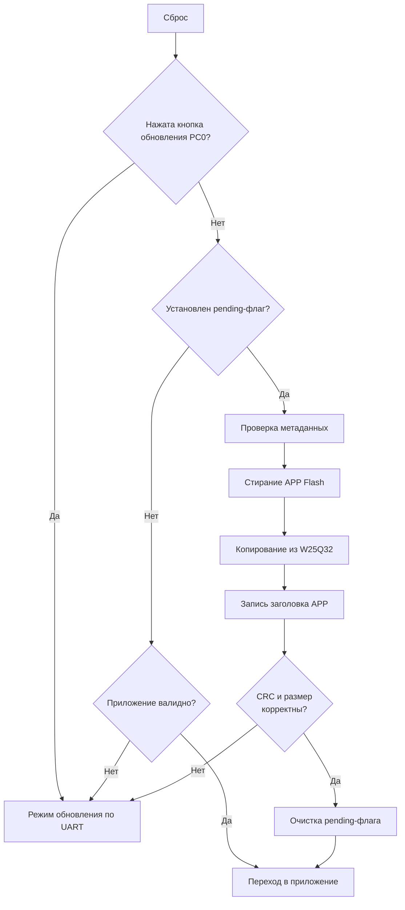

## Загрузчик K1921VG015

### Назначение

`bootloader` обслуживает два сценария:

- классическое обновление приложения по UART4 (протокол `boot.py`);
- применение pending-обновления из внешней W25Q32, которое заранее загружает приложение по OSDP (`osdp_FILETRANSFER`) и помечает через общий `update_flag`.

Загрузчик стирает/пишет область приложения во внутренней Flash, проверяет CRC32 и передаёт управление приложению.

### Актуальная структура

- `include/bl_config.h` — адреса/размеры (`BL_*`, `APP_*`) и коды протокола.
- `include/bl_image.h`, `src/bl_image.c` — формат `bl_app_header_t` и валидация образа.
- `include/bl_hal.h`, `src/bl_hal.c` — UART/GPIO/Flash HAL.
- `src/bl_extflash_w25q32.c` — чтение W25Q32 для переноса во внутреннюю Flash.
- `src/bl_main.c` — логика старта: update mode / apply pending / jump to app.
- `device/ldscripts/k1921vg015_boot.ld` — линковка загрузчика в `0x80000000`.

### Карта памяти (текущая)

- `BL_BASE_ADDR = 0x80000000`, `BL_SIZE_BYTES = 0x00002000` (8 KB).
- `APP_BASE_ADDR = 0x80002000`.
- `APP_MAX_SIZE_BYTES = 0x000FD000`.
- `APP_HEADER_ADDR = APP_BASE_ADDR`.
- `APP_PAYLOAD_ADDR = APP_HEADER_ADDR + 8`.
- `APP_PAYLOAD_MAX_SIZE_BYTES = APP_MAX_SIZE_BYTES - 8`.

Формат заголовка приложения:

```c
typedef struct {
    uint32_t image_size;
    uint32_t crc32;
} bl_app_header_t;
```

### Логика старта

1. `bl_hal_init()`: UART4 (`PA8/PA9`), кнопка update (`PC0`), LED (`PA12..PA15`).
2. Если кнопка update нажата -> `bl_enter_update_mode()`.
3. Если кнопка не нажата:
   - пытается применить pending из W25Q32 (`BL_ENABLE_EXTFLASH_UPDATE`);
   - если внутренний образ валиден -> `bl_jump_to_app(APP_ENTRY_ADDR)`;
   - иначе остаётся в `bl_enter_update_mode()`.

### Pending-обновление из W25Q32

Источник pending-метаданных — `update_flag_t` по `UPDATE_FLAG_ADDR_ABS`.

Поток:

1. Проверка `update_flag_is_pending`.
2. Чтение метаданных образа (предпочтительно header из внешней Flash; fallback на `update_flag`).
3. Проверка `uf->total_size == sizeof(bl_app_header_t) + image_size`.
4. Erase диапазона приложения во внутренней Flash.
5. Копирование payload из внешней W25Q32 (`slot_base + 8`) чанками в `APP_PAYLOAD_ADDR`.
6. Запись `bl_app_header_t` во внутреннюю Flash.
7. Финальная валидация (`bl_image_is_valid()` + размер).
8. Очистка pending-флага (стирание страницы флага).

### LED-индикация

- Во время erase+copy светодиоды режима обновления (`PA12..PA15`) включены.
- При ошибке выставляется код через `bl_hal_set_error_code(...)`.
- При успехе индикация гаснет перед переходом в приложение.

### Диаграмма процесса



### Сборка

В каталоге `bootloader/`:

```bash
make all
```

Артефакты:
- `build/bootloader.elf`
- `build/bootloader.hex`
- `build/bootloader.dump`

### Прошивка bootloader

Через VS Code задачу `bootloader-flash` (OpenOCD `program ... verify`) или эквивалентной командой OpenOCD.

### Аппаратные линии

- UART4: `PA9` (TX), `PA8` (RX)
- Update button: `PC0` (active low)
- LED: `PA12..PA15`
- Внешняя W25Q32 (через SPI0): `PB0` SCK, `PB2` MISO, `PB3` MOSI, `PB1` CS

